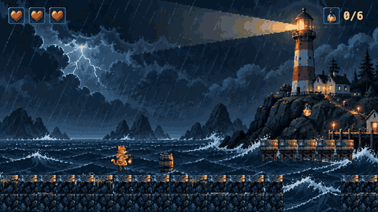
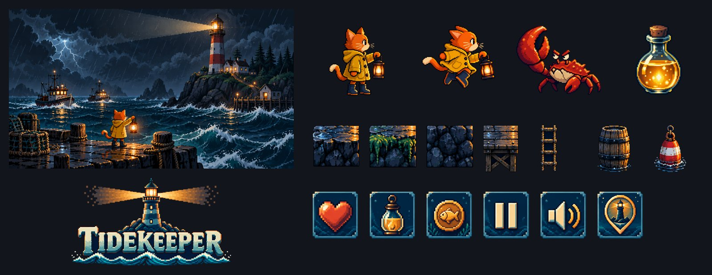
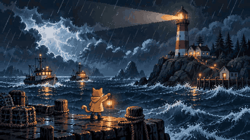

<div align="center">

# HiAPI 游戏素材工坊

**说出你的游戏，拿到整套风格统一的游戏素材，外加一个能玩的原型。**

角色精灵 · 地块 · UI 图标 · 视差背景 · 标题 Logo · 音乐 · 配音 · 预告片<br>
一个计划文件，一个 [HiAPI](https://www.hiapi.ai/zh) Key，任何编程 Agent（Claude Code、Codex、Cursor……）都能用

[English](README.md) · 简体中文 · AI Agent？先读 [llms-install.md](llms-install.md)



<sub>《Tidekeeper 守灯塔的猫》——上面每一个角色、地块、图标、背景、音乐和 Logo，都出自同一个 <a href="examples/tidekeeper/plan.json">plan.json</a>。几分钟，花费 $2.34。</sub>

</div>

## 一句话做出了什么



| | |
|---|---|
|  | **14 个素材，3 类模型，1 个 Key** <br>• 主视觉、主角站姿和跳跃姿势、敌人、道具：每张图里都是同一只猫<br>• 6×3 地块表和 6 个 UI 图标，自动切成透明 PNG<br>• 远景、近景两层视差背景，标题 Logo<br>• 两段芯片音乐循环，一句中文旁白<br>• 由主视觉生成的 8 秒预告片<br><br>▶ [play.html](examples/tidekeeper/play.html)（克隆后用浏览器打开就能玩） · 🎵 [全部素材](examples/tidekeeper/assets/) |

## 安装

```bash
npx -y github:HiAPIAI/hiapi-game-asset-studio-skill -y
export HIAPI_API_KEY=你的key        # https://www.hiapi.ai/zh/dashboard/api-keys
```

然后对 Agent 说：

- 「做一个像素风横版小游戏的全套素材：一只守灯塔的猫，再搭一个能玩的原型。」
- 「俯视角肉鸽，手绘风：主角、4 个敌人、地牢地块、道具图标、Boss 战音乐。」
- 「这是我画的角色草图，做成精灵图，要站立和跳跃两个姿势，设计保持一致。」（把图作为 `file` 素材传入）

## 为什么风格能统一

每张图都挂在一个「锚点」上：先生成主视觉，之后每个角色、敌人、背景都**以它为参考**生成（图生图），每个新姿势再以对应角色为参考。每条提示词后面还会自动附上同一段画风描述。所以整套素材看起来像同一个游戏，而不是二十张互不相干的图。

## 用到的模型

| 环节 | HiAPI 上的模型 |
|---|---|
| 图片、精灵、素材表 | GPT Image 2.5（文生图、图生图、透明背景） |
| 抠图 | 背景移除 |
| 音乐 | MiniMax Music 2.6 |
| 配音 | Qwen Audio TTS |
| 预告片 | Seedance 2.0 Fast |

`run-plan.mjs` 按依赖顺序并行跑完整个计划，`--dry-run` 免费预估费用，中断后从断点继续。`slice.py` 把素材表切成可直接用的 PNG，`gallery.mjs` 生成一页总览，方便检查。

## 许可

MIT。生成的素材按 HiAPI 及各模型提供方的条款使用。
